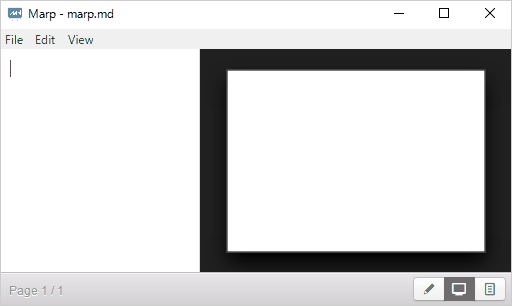

# Utiliser Marp et Markdown comme alternative libre à Google Doc

Pendant des années j'utilisais Google doc pour faire de présentations partagées de mes contenus. Problème ce logiciel propriétaires tres puissant enferme dans un format qui oblige les autres utilisateurs à faire de même ou exporter en ppt (verifier pour open document). Ceci rend difficle la collaboration avec les personnes utilisant d'autres formats.

J'étais donc à la recherche d'une solution alternative vraiment libre et facilitant la mutualisation et l'interopérabilité des contenus.

Jusqu'a présent le bénéfice d'usage de Google doc et le cout en temps/energie des alternative était trop important pour passer à autre chose, mais aujourd'hui j'ai trouvé une excellente alternative qui m'apporte plus de bénéfices.

## Markdown ?

Markdown est un système d’édition et de formatage de texte qui permet de rajouter du gras, des titres, des liens dans un document texte avec une syntaxe assez simple a apprendre (par exemple des dieses pour les titres, des tirets pour les listes à puces...).

Sur le web, de nombreux outils et logiciels (parmi eux WordPress ou Github) reconnaissent markdown et l'affichent au format désiré tout beau tout joli sans avoir besoins de mettre du code HTML ou d'utiliser un logiciel particulier.

La force de Markdown c'est son interopérabilité. Comme il est reconnu par de nombreux outils, il suffit de rajouter quelques caractères dans son document et quand celui ci sera publié en ligne il prendra l'aspect du site où il est publié. Il pourra ainsi être affiché sur de multiples plateformes sans problème de compatibilité de format.

Le présent tutoriel est lui même rédigé en markdown.

https://fr.wikipedia.org/wiki/Markdown
 
## Marp

Marp est un logiciel libre assez simple qui permet de faire des présentations en utilisant la syntaxe markdown.

En quelque mots Marp,

- est multiplatforme
- permet de créer des présentation en Markdown
- permet un aperçu visuel en direct
- permet de créer des thèmes personnalisés (deux thèmes existent par défaut)
- permet d'ajouter des émoticonnes et des images de fond
- permet l'export des diapos en PDF

## Créer une présentation avec Marp

- Installez Marp
https://yhatt.github.io/marp/

- Utilisez Markdown pour ajouter vos titres, liste à puces, liens, ...

Seules nouvelles balises à retenir par rapport au markdown standard: 
- l'option bg pour ajouter une image de fond atténuée pour que le texte soit lisible (ou bg original pour garder les couleurs originales non-atténuées)
- l'usage de trois tirets pour séparer les diapos.

autre option, ajouter des commentaires qui n'apparaitront pas dans le diaporama, mais seront accessible dans le fichier source (balises "< ! --- commentaires --- >)

## Usage de Marp/Markdown comme alternative libre a Google présentation

Marp possède très peu de fonctionnalités et d'options de formattage, mais pour moi ajouter un titre et une image de fond suffisent à mon usage dans 99% des cas.

Par contre marp me permet de créer à la fois :
- un contenu diaporama que je pourrai exporter comme PDF pour mes présentations
- le même contenu sous forme de fiche avec les commentaires de présentations que je pourrai publier simplement sur Github/MultiBAO pour partage et mutualisation.

Le cout d'edition est faible, éditer dans un traitement de texte est plus rapide que d'utiliser Google Présentation et surtout je peux partager simplement au format texte ou présentation sans effort supplémentaire, chose que je ne pouvais pas faire.

## Exemple d'usage

Voici donc le fichier au format markdown qui est modifiable dans marp pour faire une présentation avec aperçu visuel ou simplement dans un traitement de texte pour avoir accès aux notes de présentations:
https://github.com/lilianricaud/presentations/blob/master/stigmergie.md

le même contenu sous forme de PDF utilisable pour donner une présentation:
https://github.com/lilianricaud/presentations/blob/master/stigmergie-presentation-dec2016.pdf

## Autres alternatives

Il existe aussi la possibilité de faire des présentations markdown lisibles par impress.js outils de présentation plus puissant, mais pour moi cet outil s'il offre plus de possibiité demande plus de temps et d'energie pour la prise en main et la gestion au quotidien.

## Source 

CC-BY-SA Lilian Ricaud
www.lilianricaud.com

